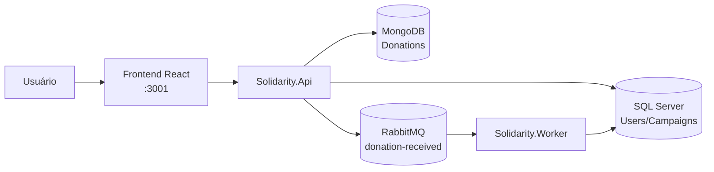
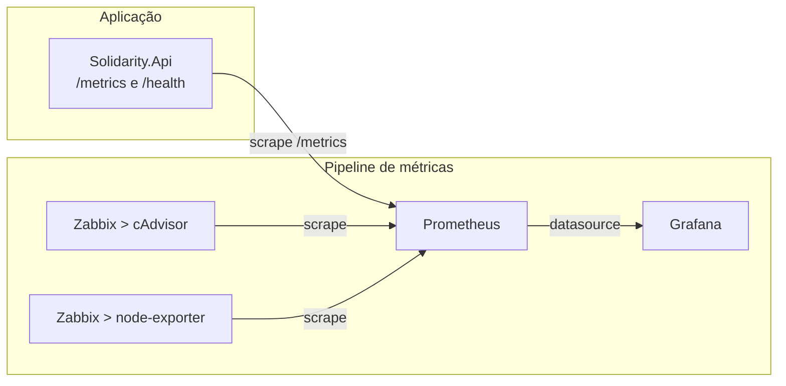

# Solidarity Connection

Projeto Hackathon Fase 5 - Pós-Tech Arquitetura Sistemas .NET.
Plataforma de arrecadação solidária baseada em microsserviços, mensageria e processamento assíncrono.
O sistema permite o gerenciamento de campanhas beneficentes, cadastro de doadores e processamento de doações utilizando SQL Server, MongoDB e RabbitMQ.

---

# Arquitetura

## Fluxo funcional (negócio)



## Fluxo de observabilidade e monitoramento



---

# Tecnologias Utilizadas

- .NET 10
- ASP.NET Core Web API
- React + TypeScript + Vite + Tailwind CSS
- Entity Framework Core
- SQL Server
- MongoDB
- RabbitMQ
- JWT Authentication
- Swagger
- Prometheus
- Grafana
- Zabbix
- Docker
- Docker Compose
- Kubernetes

---

# Estrutura da Solução

```text
SolidarityConnection

├── Solidarity.Api
├── Solidarity.Application
├── Solidarity.Domain
├── Solidarity.Infrastructure
├── Solidarity.Shared
├── Solidarity.Worker
├── observability
├── k8s
└── docker-compose.yml
```

---

# Perfis de Usuário

## NgoManager

Responsável pelo gerenciamento de campanhas.
Permissões:
- Criar campanhas;
- Atualizar campanhas;
- Cancelar campanhas;

## Donor

Responsável por realizar doações.
Permissões:
- Consultar campanhas;
- Realizar doações;

---

# Requisitos

## Docker Desktop

Instalar:
https://www.docker.com/products/docker-desktop/

Verificar:

```bash
docker --version
docker compose version
```

## .NET SDK

Instalar:
https://dotnet.microsoft.com/download

Verificar:

```bash
dotnet --version
```

---

# Executando com Docker Compose

## 1) Subir os serviços

Na raiz do projeto:

```bash
docker compose up -d
```

## 2) Validar containers

```bash
docker ps
```

Containers esperados:

```text
solidarity-sqlserver
solidarity-mongodb
solidarity-rabbitmq
solidarity-api
solidarity-worker
solidarity-prometheus
solidarity-grafana
solidarity-node-exporter
solidarity-cadvisor
solidarity-zabbix-db
solidarity-zabbix-server
solidarity-zabbix-web
solidarity-zabbix-agent
solidarity-zabbix-init
```

## 3) Acessos no Docker Compose

```text
Frontend (React): http://localhost:3001
API/Swagger:      http://localhost:8080/swagger
Health:           http://localhost:8080/health
Métricas da API:  http://localhost:8080/metrics
RabbitMQ UI:      http://localhost:15672
Prometheus:       http://localhost:9090
Grafana:          http://localhost:3000
Zabbix Web:       http://localhost:8082
```

Credenciais padrão:

```text
RabbitMQ: guest / guest
Grafana:  admin / Admin@123
Zabbix:   Admin / zabbix
```

---

# Frontend (React)

Interface web da plataforma: painel de transparência público, cadastro de doador,
login, doação e área de gestão de campanhas.

Stack: React + TypeScript + Vite + Tailwind CSS.

## Executando junto do Docker Compose

Já sobe com `docker compose up -d`:

```text
http://localhost:3001
```

## Executando em modo desenvolvimento

Com a API no ar (`docker compose up -d api`):

```bash
cd frontend
npm install
npm run dev
```

```text
http://localhost:5173
```

A URL da API é configurável por variável de ambiente (ver `frontend/.env.example`):

```text
VITE_API_URL=http://localhost:8080
```

## Telas

- `/` — Painel de Transparência (público): campanhas ativas, meta e valor arrecadado;
- `/cadastro` — cadastro de doador (com máscara e validação de CPF);
- `/login` — autenticação (JWT);
- `/gestor` — gestão de campanhas (restrito à role NgoManager).

## Demonstração do fluxo assíncrono

Ao confirmar uma doação, a API responde 202 (evento publicado na fila) e a barra de
progresso da campanha entra em estado "processando na fila". O painel recarrega
automaticamente e a barra sobe assim que o Worker consome o evento do RabbitMQ e
atualiza o valor arrecadado — evidenciando, na interface, o processamento assíncrono.

## CORS

A API libera as origens do frontend em `Cors:AllowedOrigins` (`appsettings.json`):

```text
http://localhost:5173   (Vite em modo dev)
http://localhost:3001   (container do frontend)
```

---

# Executando com Kubernetes (Docker Desktop)

## Pré-requisitos

- Docker Desktop com Kubernetes habilitado;
- kubectl disponível no terminal.

Verificar:

```bash
kubectl version --client
kubectl config current-context
```

Contexto esperado no Docker Desktop:

```text
docker-desktop
```

## 1) Gerar imagens locais da API e Worker

Na raiz do projeto:

```bash
docker build -t solidarity-api:local -f Solidarity.Api/Dockerfile .
docker build -t solidarity-worker:local -f Solidarity.Worker/Dockerfile .
docker build -t solidarity-frontend:local ./frontend
```

## 2) Aplicar manifests Kubernetes

```bash
kubectl apply -k k8s
```

Os manifests entregues em k8s/ incluem:

- Namespace;
- ConfigMaps;
- Deployments;
- Services;
- Jobs;
- PersistentVolumeClaims (SQL Server, MongoDB e RabbitMQ).

## 3) Validar recursos no cluster

```bash
kubectl get pods -n solidarity
kubectl get svc -n solidarity
kubectl get pvc -n solidarity
```

## 4) Criar port-forwards

No Kubernetes, execute os port-forwards abaixo (cada comando em um terminal separado):

```bash
kubectl port-forward -n solidarity svc/solidarity-api 8080:8080
kubectl port-forward -n solidarity svc/solidarity-frontend 3001:80
kubectl port-forward -n solidarity svc/rabbitmq 15672:15672
kubectl port-forward -n solidarity svc/prometheus 9090:9090
kubectl port-forward -n solidarity svc/grafana 3000:3000
kubectl port-forward -n solidarity svc/zabbix-web 8082:8080
```

## 5) Acessos no Kubernetes

Os endpoints abaixo ficam iguais aos do Compose, mas só funcionam após os port-forwards:

```text
API/Swagger:      http://localhost:8080/swagger
Health:           http://localhost:8080/health
Métricas da API:  http://localhost:8080/metrics
RabbitMQ UI:      http://localhost:15672
Prometheus:       http://localhost:9090
Grafana:          http://localhost:3000
Zabbix Web:       http://localhost:8082
```

Credenciais padrão:

```text
RabbitMQ: guest / guest
Grafana:  admin / Admin@123
Zabbix:   Admin / zabbix
```

## 6) Remover ambiente Kubernetes

```bash
kubectl delete namespace solidarity
```

Para remover também os dados persistidos:

```bash
kubectl delete pvc -n solidarity --all
```

---

# Endpoints da API e Como Acessar

Com o ambiente rodando (Compose ou Kubernetes com port-forward), acesse primeiro o Swagger:

```text
http://localhost:8080/swagger
```

A partir dele, você pode testar os endpoints abaixo.

## Usuário Seed

O sistema cria automaticamente um gestor inicial.

```text
Email: manager@solidarity.com
Senha: 123456
Role:  NgoManager
```

## Fluxo de Autenticação

### Registrar usuário

POST

```http
/api/auth/register
```

Exemplo:

```json
{
  "fullName": "Teste",
  "email": "teste@fiap.com.br",
  "cpf": "529.982.247-25",
  "password": "123456"
}
```

O CPF é validado (formato e dígitos verificadores) e aceito com ou sem máscara.
CPFs inválidos retornam 400. O valor é armazenado apenas com dígitos.

### Login

POST

```http
/api/auth/login
```

Exemplo:

```json
{
  "email": "teste@fiap.com.br",
  "password": "123456"
}
```

Retorno:

```json
{
  "token": "JWT_TOKEN"
}
```

## Campanhas

### Criar campanha

POST

```http
/api/campaigns
```

Role necessária:

```text
NgoManager
```

Exemplo:

```json
{
  "title": "Exemplo de Campanha",
  "description": "Descrição do Exemplo de Campanha",
  "startDate": "2026-06-20T00:00:00",
  "endDate": "2026-07-20T00:00:00",
  "financialGoal": 10000
}
```

### Listar campanhas

GET

```http
/api/campaigns
```

### Campanhas ativas

GET

```http
/api/campaigns/active
```

Retorna:
- Title;
- FinancialGoal;
- TotalRaised;

## Doações

### Criar doação

POST

```http
/api/donations
```

Role necessária:

```text
Donor
```

Exemplo:

```json
{
  "campaignId": "GUID",
  "amount": 50
}
```

---

# Configuração para Desenvolvimento Local

## Aplicar migrations (base SQL)

```bash
dotnet ef database update \
--project Solidarity.Infrastructure \
--startup-project Solidarity.Api
```

## Executar API localmente

```bash
dotnet run --project Solidarity.Api
```

Swagger local:

```text
http://localhost:5131/swagger
```

## Executar Worker localmente

Em outro terminal:

```bash
dotnet run --project Solidarity.Worker
```

---

# Fluxo Assíncrono

Ao receber uma doação:

1. API valida a campanha;
2. API grava a doação no MongoDB;
3. API publica evento no RabbitMQ;
4. Worker consome o evento;
5. Worker atualiza o TotalRaised da campanha;

---

# Persistência e Mensageria

## Banco SQL Server

Tabelas:

```text
Users
Campaigns
```

## Banco MongoDB

Coleções:

```text
donations
```

## Mensageria

Fila:

```text
donation-received
```

Evento:

```text
DonationReceivedEvent
```

---

# Teste Completo

## Passo 1

Login como gestor.

## Passo 2

Criar campanha.

## Passo 3

Registrar novo doador.

## Passo 4

Login com doador.

## Passo 5

Realizar doação.

## Passo 6

Verificar:

- MongoDB recebeu a doação;
- RabbitMQ processou a fila;
- Worker atualizou o TotalRaised;

---

# Autores

Projeto acadêmico desenvolvido para demonstração de arquitetura baseada em microsserviços, mensageria e processamento assíncrono utilizando .NET.
Alunos: Pedro, Tony, Diego e Gustavo.
Curso: Pós-Tech Arquitetura Sistemas .NET.
Projeto: Hackathon Fase 5.
