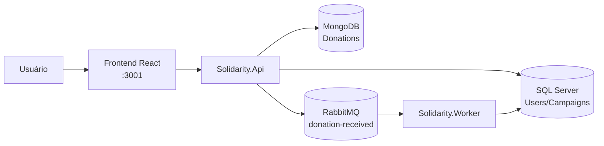
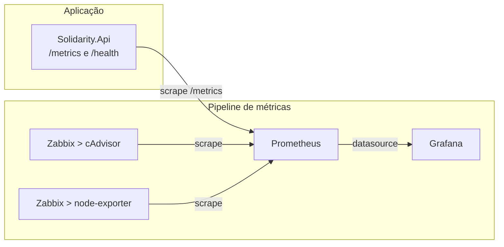

# Solidarity Connection

Projeto Hackathon Fase 5 - Pós-Tech Arquitetura Sistemas .NET.
Plataforma de arrecadação solidária baseada em microsserviços, mensageria e processamento assíncrono.
O sistema permite o gerenciamento de campanhas beneficentes, cadastro de doadores e processamento de doações utilizando SQL Server, MongoDB e RabbitMQ.

---

# Arquitetura

## Fluxo funcional (negócio)



## Fluxo de observabilidade e monitoramento



---

# Tecnologias Utilizadas

- .NET 10
- ASP.NET Core Web API
- React + TypeScript + Vite + Tailwind CSS
- Entity Framework Core
- SQL Server
- MongoDB
- RabbitMQ
- JWT Authentication
- Swagger
- Prometheus
- Grafana
- Zabbix
- Docker
- Docker Compose
- Kubernetes
- GitHub Actions (CI/CD)
- xUnit + Moq (testes de unidade)

---

# Estrutura da Solução

```text
SolidarityConnection

├── Solidarity.Api             API REST (campanhas, doadores, doações)
├── Solidarity.Application     DTOs e contratos (interfaces)
├── Solidarity.Domain          Entidades, enums e regras de validação
├── Solidarity.Infrastructure  EF Core, MongoDB, RabbitMQ, JWT
├── Solidarity.Shared          Eventos e versão da aplicação
├── Solidarity.Worker          Consumidor da fila de doações
├── frontend                   Aplicação React (SPA)
├── tests                      Testes de unidade (xUnit)
│   ├── Solidarity.Domain.Tests
│   └── Solidarity.Api.Tests
├── observability              Prometheus, Grafana e Zabbix
├── k8s                        Manifests do Kubernetes
├── .github/workflows          Pipelines de CI e de rollback
├── VERSION                    Fonte única da versão da plataforma
└── docker-compose.yml
```

---

# Perfis de Usuário

## NgoManager

Responsável pelo gerenciamento de campanhas.
Permissões:
- Criar campanhas;
- Atualizar campanhas;
- Cancelar campanhas;

## Donor

Responsável por realizar doações.
Permissões:
- Consultar campanhas;
- Realizar doações;

---

# Regras de Negócio e Validações

## Campanha (GestorONG)

- Título, Descrição, Data de Início, Data de Término, Meta Financeira e Status;
- A data de término não pode estar no passado;
- A meta financeira deve ser maior que zero;
- Status possíveis: `Ativa`, `Concluída` e `Cancelada`.

## Cadastro de Doador (público)

- E-mail único no banco (índice único);
- **CPF validado**: formato e dígitos verificadores, aceito com ou sem máscara
  (`529.982.247-25` ou `52998224725`); armazenado apenas com dígitos;
- **Senha com política mínima**, validada no domínio (`PasswordPolicy`):
  - mínimo de 8 caracteres;
  - ao menos uma letra;
  - ao menos um número;
  - ao menos um caractere especial.
- Senha armazenada com hash **BCrypt**;
- A API retorna 400 informando exatamente qual requisito não foi atendido.

## Doação (Doador logado)

- Exclusiva do perfil `Donor` (o gestor não doa);
- Não é permitida em campanhas canceladas ou concluídas;
- A API **não** atualiza o valor arrecadado: publica um evento e responde `202 Accepted`.

---

# Testes de Unidade

Suíte com **58 testes** (xUnit, padrão AAA, mocks com Moq).

```bash
dotnet test SolidarityConnection.slnx
```

Cobertura:

```text
tests/Solidarity.Domain.Tests   Validação de CPF e política de senha
tests/Solidarity.Api.Tests      Autenticação, campanhas e doações
```

Destaque: o teste `Create_WhenCampaignIsActive_DoesNotUpdateTotalRaisedDirectly`
garante o requisito arquitetural de que a API **não** atualiza o valor arrecadado —
quem faz isso é o Worker, ao consumir a fila.

Os testes rodam automaticamente na esteira de CI: se algum falhar, as imagens
Docker não são publicadas.

---

# Requisitos

## Docker Desktop

Instalar:
https://www.docker.com/products/docker-desktop/

Verificar:

```bash
docker --version
docker compose version
```

## .NET SDK

Instalar:
https://dotnet.microsoft.com/download

Verificar:

```bash
dotnet --version
```

---

# Executando com Docker Compose

**Não é necessário compilar nada.** As imagens da API, do Worker e do Frontend são
publicadas pelo pipeline de CI no GitHub Container Registry (GHCR) e baixadas
prontas — todos rodam exatamente o mesmo artefato.

```bash
docker compose pull
docker compose up -d
```

Só isso. Acesse http://localhost:3001.

## Forma recomendada (script)

O script baixa a versão correta e **confirma no final qual versão ficou de fato
em execução** (falha se divergir):

```bash
./scripts/deploy.sh              # baixa a versão do arquivo VERSION
./scripts/deploy.sh 1.1.0        # baixa uma versão específica (rollback)
./scripts/deploy.sh latest       # baixa a versão mais recente publicada
./scripts/deploy.sh --build      # compila do código-fonte (só para desenvolvimento)
```

Saída esperada:

```text
================ EM EXECUCAO ================
  API      : {"service":"Solidarity.Api","version":"1.1.3", ...}
  Worker   : Solidarity.Worker versao 1.1.3 iniciado.
  Frontend : http://localhost:3001

OK: a versao em execucao (1.1.3) confere com a versao alvo.
```

Se a versão em execução divergir da esperada, o script falha — em vez de deixar
passar silenciosamente.

**Dois modos, quando usar cada um:**

| Modo | O que faz | Quando usar |
|---|---|---|
| padrão | Baixa a imagem publicada pelo pipeline (GHCR) | Sempre — inclusive para corrigir/avaliar o projeto |
| `--build` | Compila o código atual e gera a imagem | Apenas em desenvolvimento, para testar alterações locais |

Compilar do código-fonte usa a sobreposição `docker-compose.build.yml`:

```bash
docker compose -f docker-compose.yml -f docker-compose.build.yml up -d --build
```

> Sem a variável `APP_VERSION`, o Compose usa a tag `latest` (versão mais recente
> publicada). Para fixar uma versão específica, defina `APP_VERSION=1.2.0` — é assim
> que se faz o rollback.

## Subindo tudo manualmente

```bash
docker compose up -d
```

## 2) Validar containers

```bash
docker ps
```

Containers esperados:

```text
solidarity-sqlserver
solidarity-mongodb
solidarity-rabbitmq
solidarity-api
solidarity-worker
solidarity-prometheus
solidarity-grafana
solidarity-node-exporter
solidarity-cadvisor
solidarity-zabbix-db
solidarity-zabbix-server
solidarity-zabbix-web
solidarity-zabbix-agent
solidarity-zabbix-init
```

## 3) Acessos no Docker Compose

```text
Frontend (React): http://localhost:3001
API/Swagger:      http://localhost:8080/swagger
Health:           http://localhost:8080/health
Versão:           http://localhost:8080/version
Métricas da API:  http://localhost:8080/metrics
RabbitMQ UI:      http://localhost:15672
Prometheus:       http://localhost:9090
Grafana:          http://localhost:3000
Zabbix Web:       http://localhost:8082
```

Credenciais padrão:

```text
RabbitMQ: guest / guest
Grafana:  admin / Admin@123
Zabbix:   Admin / zabbix
```

---

# Frontend (React)

Interface web da plataforma: painel de transparência público, cadastro de doador,
login, doação e área de gestão de campanhas.

Stack: React + TypeScript + Vite + Tailwind CSS.

## Executando junto do Docker Compose

Já sobe com `docker compose up -d`:

```text
http://localhost:3001
```

## Executando em modo desenvolvimento

Com a API no ar (`docker compose up -d api`):

```bash
cd frontend
npm install
npm run dev
```

```text
http://localhost:5173
```

A URL da API é configurável por variável de ambiente (ver `frontend/.env.example`):

```text
VITE_API_URL=http://localhost:8080
```

## Telas

- `/` — **Site institucional**: hero, indicadores de impacto, história da ONG,
  como ajudar, prévia das campanhas ativas, depoimentos, parceiros e chamada final;
- `/campanhas` — **Painel de Transparência** (público): campanhas ativas, meta e
  valor arrecadado. O botão **Doar agora** aparece para doadores autenticados;
- `/sobre` — missão, visão, valores e linha do tempo da organização;
- `/contato` — canais de contato e formulário (ilustrativo);
- `/cadastro` — cadastro de doador: máscara de CPF, requisitos de senha exibidos
  em tempo real e confirmação de senha;
- `/login` — autenticação (JWT);
- `/gestor` — gestão de campanhas (restrito à role NgoManager): criar, editar e cancelar.

> O conteúdo institucional (história, depoimentos, parceiros e números de atuação)
> é ilustrativo. Os indicadores de campanhas e valores arrecadados vêm da API.

## Detalhes de usabilidade

- **Responsivo** (mobile, tablet e desktop), com menu hamburguer abaixo de 1024px;
- Ilustrações em **SVG inline**, sem dependência de CDN ou de imagens externas —
  a interface continua íntegra mesmo sem internet;
- Campos de valor (doação e meta financeira) usam **máscara monetária pt-BR**:
  digite apenas números e o campo formata automaticamente (`150000` → `1.500,00`);
- O campo de senha mostra os requisitos abaixo dele, marcados conforme são atendidos;
- A doação é restrita ao perfil `Donor`. Gestores veem um aviso explicando isso,
  e visitantes veem o botão **Entrar para doar**.

## Demonstração do fluxo assíncrono

Ao confirmar uma doação, a API responde 202 (evento publicado na fila) e a barra de
progresso da campanha entra em estado "processando na fila". O painel recarrega
automaticamente e a barra sobe assim que o Worker consome o evento do RabbitMQ e
atualiza o valor arrecadado — evidenciando, na interface, o processamento assíncrono.

## CORS

A API libera as origens do frontend em `Cors:AllowedOrigins` (`appsettings.json`):

```text
http://localhost:5173   (Vite em modo dev)
http://localhost:3001   (container do frontend)
```

---

# CI/CD (GitHub Actions)

Pipeline em `.github/workflows/ci.yml`, disparado a cada push na `main` e em
pull requests. **Todo push na `main` gera automaticamente uma nova versão final.**

```text
version  ──>  build (.NET)  ──>  docker (api|worker|frontend)  ──>  release
calcula       restore            build das imagens                  tag git
o semver      build              push para o GHCR                   GitHub Release
              test (58)          tags imutáveis                     CHANGELOG
```

- O job `docker` só executa se o `build` **e os testes** passarem —
  imagem quebrada não é publicada;
- O job `release` só executa se as imagens forem publicadas — nunca existe
  uma tag git sem as imagens correspondentes;
- Em pull request tudo é construído e testado, mas nada é publicado.

## Versionamento automático (Conventional Commits)

A versão é calculada a partir das mensagens de commit desde a última tag:

| Prefixo do commit | Incremento | Exemplo |
|---|---|---|
| `feat:` | **minor** (1.1.0 → 1.2.0) | `feat: painel de doações recorrentes` |
| `fix:`, `perf:`, `refactor:`, `docs:`, `chore:` | **patch** (1.1.0 → 1.1.1) | `fix: corrige cálculo da meta` |
| `feat!:` ou `BREAKING CHANGE` no corpo | **major** (1.1.0 → 2.0.0) | `feat!: nova API de doações` |

Commits fora do padrão são tratados como `patch`. Escopos são aceitos
(`feat(front): ...`).

Ao publicar, o pipeline:

1. Calcula a próxima versão e **aborta se a tag já existir** (nunca sobrescreve
   uma versão publicada);
2. Publica as três imagens no GHCR;
3. Cria a tag `vX.Y.Z` e a **GitHub Release** com as notas geradas dos commits;
4. Devolve a versão ao repositório (`VERSION`, `.env`, `frontend/package.json`,
   `k8s/kustomization.yaml`) e atualiza o `CHANGELOG.md`, com o commit
   `chore(release): X.Y.Z [skip ci]` — que **não** dispara uma nova release.

## Histórico de imagens

Cada versão gera tags **imutáveis**, que nunca são reaproveitadas:

```text
ghcr.io/<owner>/solidarity-api:1.2.0        versão exata (imutável — é o histórico)
ghcr.io/<owner>/solidarity-api:1.2          último patch da 1.2
ghcr.io/<owner>/solidarity-api:1            último minor da 1.x
ghcr.io/<owner>/solidarity-api:latest       versão mais recente
ghcr.io/<owner>/solidarity-api:sha-<commit> rastreabilidade por commit
```

As versões anteriores permanecem disponíveis indefinidamente no GHCR — é o que
viabiliza o rollback. O mesmo vale para `solidarity-worker` e `solidarity-frontend`.

## Alterando a versão manualmente

Só é necessário em casos excepcionais (o CI faz isso sozinho):

```bash
./scripts/set-version.sh 2.0.0
```

O script mantém `VERSION`, `.env`, `frontend/package.json` e
`k8s/kustomization.yaml` sincronizados — evita o Compose subir uma versão e o
Kubernetes outra.

---

# Versionamento e Rollback

## Fonte única da versão

O arquivo `VERSION` na raiz define a versão da plataforma. Ela é propagada para:

```text
VERSION  ─┬─> Directory.Build.props  -> assemblies .NET (API e Worker)
          ├─> frontend/package.json  -> bundle do React
          ├─> Dockerfile (APP_VERSION) -> label e binário da imagem
          ├─> docker-compose (tag da imagem: solidarity-api:1.0.0)
          └─> k8s/kustomization.yaml (newTag)
```

Nenhuma imagem da aplicação roda com tag mutável: cada versão gera uma imagem
imutável própria. É isso que torna o rollback possível.

## Conferindo a versão em execução

```bash
curl http://localhost:8080/version
```

```json
{ "service": "Solidarity.Api", "version": "1.0.0", "environment": "Production" }
```

O Worker registra a versão no log de inicialização e o frontend a exibe no rodapé.

## Versionamento no CI

Automático: cada push na `main` publica uma versão final, calculada a partir dos
Conventional Commits. Veja a seção **CI/CD** acima.

Não é necessário criar tags manualmente — o pipeline cria a tag `vX.Y.Z`,
a GitHub Release e atualiza o `CHANGELOG.md`.

## Rollback pelo GitHub Actions (artefato publicado)

Workflow `.github/workflows/rollback.yml`, acionado manualmente
(**Actions → Rollback → Run workflow**), informando a versão de destino
(ex.: `1.0.0-build.12`).

O que ele faz:

1. Verifica se a versão informada existe no GHCR (aborta se não existir);
2. Reaponta a tag `latest` das três imagens para essa versão, de forma sequencial,
   evitando que os serviços fiquem em versões diferentes entre si.

> **Importante:** este workflow reverte o **artefato publicado**, não o ambiente em
> execução. Como a aplicação roda localmente (Docker Desktop / Kubernetes local), o
> GitHub não tem acesso ao cluster — o rollback do ambiente é feito na máquina,
> conforme as duas seções abaixo.

## Rollback com Docker Compose

Cada versão fica disponível como imagem local/registro. Para voltar:

```bash
APP_VERSION=1.0.0 docker compose up -d --no-build api worker frontend
```

Confirme:

```bash
curl http://localhost:8080/version
```

## Rollback com Kubernetes

Os Deployments usam `RollingUpdate` com `maxUnavailable: 0` — o pod novo só
recebe tráfego após passar no probe `/health`. Se a versão nova subir quebrada,
os pods antigos continuam atendendo.

Histórico de revisões:

```bash
kubectl rollout history deployment/solidarity-api -n solidarity
```

Voltar para a revisão anterior:

```bash
kubectl rollout undo deployment/solidarity-api -n solidarity
kubectl rollout undo deployment/solidarity-worker -n solidarity
kubectl rollout undo deployment/solidarity-frontend -n solidarity
```

Voltar para uma revisão específica:

```bash
kubectl rollout undo deployment/solidarity-api -n solidarity --to-revision=2
```

Acompanhar o rollout:

```bash
kubectl rollout status deployment/solidarity-api -n solidarity
```

Alternativamente, altere `newTag` em `k8s/kustomization.yaml` para a versão
desejada e reaplique com `kubectl apply -k k8s`.

---

# Executando com Kubernetes (Docker Desktop)

## Pré-requisitos

- Docker Desktop com Kubernetes habilitado;
- kubectl disponível no terminal.

Verificar:

```bash
kubectl version --client
kubectl config current-context
```

Contexto esperado no Docker Desktop:

```text
docker-desktop
```

## 1) Imagens

Nada a fazer: os manifests apontam para as imagens publicadas no GHCR
(`ghcr.io/pedrojeromel/solidarity-*`), e o cluster as baixa sozinho.

A versão utilizada é controlada em `k8s/kustomization.yaml` (campo `newTag`).

## 2) Aplicar manifests Kubernetes

```bash
kubectl apply -k k8s
```

Os manifests entregues em k8s/ incluem:

- Namespace;
- ConfigMaps;
- Deployments;
- Services;
- Jobs;
- PersistentVolumeClaims (SQL Server, MongoDB e RabbitMQ).

## 3) Validar recursos no cluster

```bash
kubectl get pods -n solidarity
kubectl get svc -n solidarity
kubectl get pvc -n solidarity
```

## 4) Criar port-forwards

No Kubernetes, execute os port-forwards abaixo (cada comando em um terminal separado):

```bash
kubectl port-forward -n solidarity svc/solidarity-api 8080:8080
kubectl port-forward -n solidarity svc/solidarity-frontend 3001:80
kubectl port-forward -n solidarity svc/rabbitmq 15672:15672
kubectl port-forward -n solidarity svc/prometheus 9090:9090
kubectl port-forward -n solidarity svc/grafana 3000:3000
kubectl port-forward -n solidarity svc/zabbix-web 8082:8080
```

## 5) Acessos no Kubernetes

Os endpoints abaixo ficam iguais aos do Compose, mas só funcionam após os port-forwards:

```text
API/Swagger:      http://localhost:8080/swagger
Health:           http://localhost:8080/health
Métricas da API:  http://localhost:8080/metrics
RabbitMQ UI:      http://localhost:15672
Prometheus:       http://localhost:9090
Grafana:          http://localhost:3000
Zabbix Web:       http://localhost:8082
```

Credenciais padrão:

```text
RabbitMQ: guest / guest
Grafana:  admin / Admin@123
Zabbix:   Admin / zabbix
```

## 6) Remover ambiente Kubernetes

```bash
kubectl delete namespace solidarity
```

Para remover também os dados persistidos:

```bash
kubectl delete pvc -n solidarity --all
```

---

# Endpoints da API e Como Acessar

Com o ambiente rodando (Compose ou Kubernetes com port-forward), acesse primeiro o Swagger:

```text
http://localhost:8080/swagger
```

A partir dele, você pode testar os endpoints abaixo.

## Usuário Seed

O sistema cria automaticamente um gestor inicial.

```text
Email: manager@solidarity.com
Senha: 123456
Role:  NgoManager
```

## Fluxo de Autenticação

### Registrar usuário

POST

```http
/api/auth/register
```

Exemplo:

```json
{
  "fullName": "Teste",
  "email": "teste@fiap.com.br",
  "cpf": "529.982.247-25",
  "password": "Solidaria@2026"
}
```

O CPF é validado (formato e dígitos verificadores) e aceito com ou sem máscara.
CPFs inválidos retornam 400. O valor é armazenado apenas com dígitos.

A senha deve atender à política mínima (8+ caracteres, letra, número e caractere
especial). Senhas fracas retornam 400 informando o que falta. Exemplo:

```text
"A senha deve conter ao menos um caractere especial."
```

CPFs válidos para teste: `529.982.247-25` e `111.444.777-35`.

### Login

POST

```http
/api/auth/login
```

Exemplo:

```json
{
  "email": "teste@fiap.com.br",
  "password": "123456"
}
```

Retorno:

```json
{
  "token": "JWT_TOKEN"
}
```

## Campanhas

### Criar campanha

POST

```http
/api/campaigns
```

Role necessária:

```text
NgoManager
```

Exemplo:

```json
{
  "title": "Exemplo de Campanha",
  "description": "Descrição do Exemplo de Campanha",
  "startDate": "2026-06-20T00:00:00",
  "endDate": "2026-07-20T00:00:00",
  "financialGoal": 10000
}
```

### Listar campanhas

GET

```http
/api/campaigns
```

### Campanhas ativas

GET

```http
/api/campaigns/active
```

Retorna:
- Title;
- FinancialGoal;
- TotalRaised;

## Doações

### Criar doação

POST

```http
/api/donations
```

Role necessária:

```text
Donor
```

Exemplo:

```json
{
  "campaignId": "GUID",
  "amount": 50
}
```

---

# Configuração para Desenvolvimento Local

## Aplicar migrations (base SQL)

```bash
dotnet ef database update \
--project Solidarity.Infrastructure \
--startup-project Solidarity.Api
```

## Executar API localmente

```bash
dotnet run --project Solidarity.Api
```

Swagger local:

```text
http://localhost:5131/swagger
```

## Executar Worker localmente

Em outro terminal:

```bash
dotnet run --project Solidarity.Worker
```

---

# Fluxo Assíncrono

Ao receber uma doação:

1. API valida a campanha;
2. API grava a doação no MongoDB;
3. API publica evento no RabbitMQ;
4. Worker consome o evento;
5. Worker atualiza o TotalRaised da campanha;

---

# Persistência e Mensageria

## Banco SQL Server

Tabelas:

```text
Users
Campaigns
```

## Banco MongoDB

Coleções:

```text
donations
```

## Mensageria

Fila:

```text
donation-received
```

Evento:

```text
DonationReceivedEvent
```

---

# Teste Completo (ponta a ponta)

Pode ser feito pelo frontend (http://localhost:3001) ou pelo Swagger.

## 1) Login como gestor

```text
manager@solidarity.com / 123456
```

## 2) Criar uma campanha

Meta maior que zero e data de término no futuro.
Tente também uma data no passado ou meta zero: a API deve rejeitar com 400.

## 3) Cadastrar um doador

```text
CPF:   529.982.247-25
Senha: Solidaria@2026
```

Tente um CPF inválido (`111.111.111-11`) e uma senha fraca (`123456`):
ambos devem ser rejeitados com 400.

## 4) Login com o doador e realizar a doação

No frontend, o botão **Doar agora** aparece somente para o perfil doador.

## 5) Comprovar o processamento assíncrono

- A API responde **202 Accepted** (a doação virou um evento na fila);
- No RabbitMQ (http://localhost:15672), a mensagem passa pela fila `donation-received`;
- O Worker consome o evento e atualiza o `TotalRaised`;
- O painel público (`GET /api/campaigns/active`) passa a exibir o novo valor —
  no frontend, a barra de progresso sobe sozinha.

## 6) Conferir a versão em execução

```bash
curl http://localhost:8080/version
```

---

# Autores

Projeto acadêmico desenvolvido para demonstração de arquitetura baseada em microsserviços, mensageria e processamento assíncrono utilizando .NET.
Alunos: Pedro, Tony, Diego e Gustavo.
Curso: Pós-Tech Arquitetura Sistemas .NET.
Projeto: Hackathon Fase 5.
